## Spis treści

1. [Wstęp](#wstep)
2. [Opis przebiegu wykonanych zadań](#opis-zadan)
   1. [Charakterystyka stanowiska i obiektu regulacji](#charakterystyka)
   2. [Model matematyczny – zarys](#model-zarys)
   3. [Identyfikacja zależności indukcyjności L(x)](#identyfikacja-lx)
   4. [Poszukiwanie punktu pracy](#punkt-pracy)
   5. [Linearyzacja](#linearyzacja)
   6. [Wykonanie regulatora LQR](#lqr)
   7. [Wykonanie regulatora LQI](#lqi)
3. [Wyniki i analiza porównawcza](#wyniki)
   1. [Plan i opis pomiarów](#plan-pomiarow)
   2. [Zbiór wyników i sposób porównania](#zbior-wynikow)
   3. [Tabela wskaźników jakości – obiekt rzeczywisty](#tabela-real)
   4. [Analiza jakościowa](#analiza-jakosciowa)
   5. [Wyniki szczegółowe dla scenariuszy](#wyniki-szczegolowe)
4. [Wskaźniki jakości](#wskazniki)
5. [Wnioski końcowe](#wnioski)

---

# 1. Wstęp

Układ lewitacji magnetycznej należy do klasy obiektów wymagających szczególnie ostrożnego podejścia w projektowaniu sterowania. Nieliniowa zależność siły elektromagnetycznej od położenia oraz prądu, a także niestabilność w otwartej pętli sprawiają, że nawet niewielkie odchylenia od punktu pracy mogą prowadzić do utraty stabilnej lewitacji. Z tego powodu stanowisko to stanowi dobre środowisko do praktycznej weryfikacji metod regulacji optymalnej.

W ramach Laboratorium Problemowego przeprowadzono analizę i badania eksperymentalne stanowiska lewitacji magnetycznej z metalową kulką utrzymywaną w polu elektromagnesu. Prace obejmowały przygotowanie elementów opisu modelowego oraz zestawu pomiarów umożliwiających ocenę jakości regulacji w różnych warunkach pracy.

Głównym celem ćwiczenia było porównanie działania dwóch regulatorów opartych o podejście LQ: **LQR** oraz **LQI**. Badania skoncentrowano na dwóch typach zadań regulacji:
1. utrzymaniu kulki w zadanym położeniu (stabilizacja do wartości stałej),
2. śledzeniu zadanej trajektorii położenia zmieniającej się w czasie, w tym przebiegów sinusoidalnych o różnych amplitudach i częstotliwościach.

Ważnym elementem części przygotowawczej była identyfikacja zależności indukcyjności cewki od położenia kulki **L(x)** wykonana metodą impedancyjną oraz jej aproksymacja w środowisku MATLAB. Zależność ta wpływa na spójność opisu elektromagnesu i stanowi istotne wsparcie dalszych etapów analizy w pobliżu punktu pracy.

Eksperymenty zorganizowano parami dla tych samych scenariuszy wartości zadanej, co pozwoliło na bezpośrednie zestawienie odpowiedzi uzyskanych dla LQR i LQI. Na podstawie zarejestrowanych przebiegów położenia oraz sterowania dokonano oceny jakości regulacji, a wnioski dotyczące wpływu członu całkującego w LQI zestawiono z wynikami uzyskanymi dla klasycznego LQR.

---

# 2. Identyfikacja i modelowanie obiektu regulacji

## 2.1. Charakterystyka stanowiska i obiektu regulacji. 

Badania przeprowadzono na stanowisku lewitacji magnetycznej, w którym ferromagnetyczna kula utrzymywana jest w polu generowanym przez elektromagnes. 
Po wstępnej analizie obiektu stwierdzono, że układ jest:
- nieliniowy – parametry układu (głównie indukcyjność) zależą od stanu (położenia kuli),
- niestabilny w otwartej pętli – bez aktywnego sterowania kula opadnie lub zostanie "przyklejona" do elektromagnesu,
- szybki – mała stała czasowa narzuca wymóg wysokiej częstotliwości próbkowania oraz precyzyjnego doboru wzmocnień regulatora.

Stanowisko składa się z układu wykonawczego (elektromagnes), układu mechanicznego wyznaczającego tor ruchu kuli oraz toru pomiarowo-sterującego. 
Ważne dla jakości regulacji są precyzja pomiaru położenia oraz dynamika narastania prądu w cewce.

### Czujniki systemu pomiarowo-sterującego
Tor pomiarowy wyposażony jest w dwa czujniki, których sygnały po kondycjonowaniu trafiają do karty wejść/wyjść umieszczonej w komputerze PC.

**1. Czujnik położenia kulki**

Optyczny system pomiarowy wykonany jako układ, w którym naprzeciw siebie ustawiono źródło światła w postaci żarówki LED oraz detektor (fotorezystor) umieszczony za szkiełkiem rozpraszającym światło. Poruszająca się ferromagnetyczna kulka znajduje się między źródłem a detektorem. Kula, zmieniając swoją pozycję, częściowo przysłania wiązkę światła. Prowadzi to do zmiany natężenia oświetlenia docierającego do fotorezystora. Fotorezystor reaguje na zmienne natężenie światła, zamieniając je na odpowiadający mu sygnał elektryczny, który jest wykorzystywany jako informacja o bieżącym położeniu kulki.

**Charakterystyka czujnika położenia**

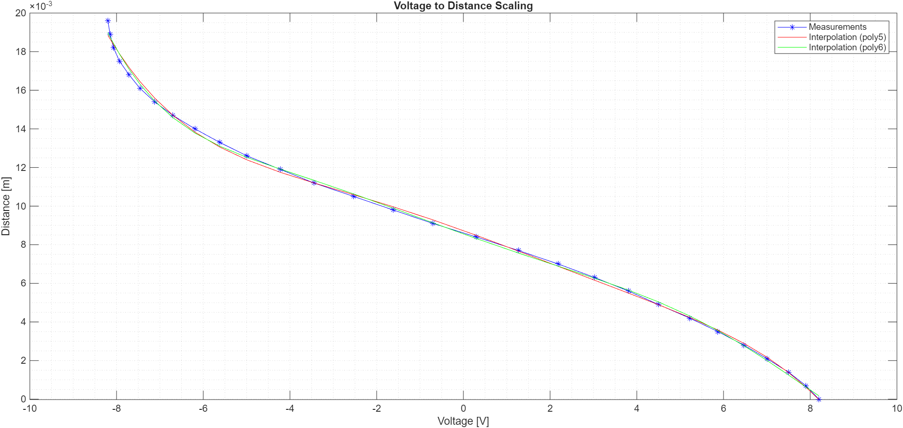

*Rys. 1. Charakterystyka czujnika położenia.*

**2. Czujnik prądu elektromagnesu**

Służy do pomiaru prądu płynącego przez cewkę elektromagnesu, czujnik wykorzystujący zjawisko Halla. 

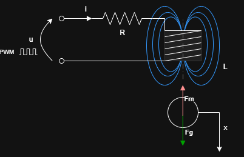

*Rys. 2. Schemat obliczeniowy modelu.*

## 2.2. Model matematyczny

Do zamodelowania dynamiki układu wykorzystano równania Lagrange'a drugiego rodzaju.
Funkcję Lagrange'a zdefiniowano jako różnicę energii kinetycznej i potencjalnej układu:
$$\mathcal{L} = E_{kin} - E_{pot} \quad(2.1)$$

Energia kinetyczna $E_{kin}$ obejmuje energię kinetyczną ruchu postępowego kuli oraz energię pola magnetycznego cewki:

$$E_{kin}=\frac{1}{2}m\dot{x}^2 + \frac{1}{2}L(x)\dot{q}^2 \quad(2.2)$$

Energia potencjalna $E_{pot}$ (związana z grawitacją) wynosi:
$$E_{pot} = -mgx \quad(2.3)$$

gdzie:
$x$ – położenie kuli (odległość od elektromagnesu, zwrot osi w dół),

$q$ – ładunek elektryczny, 

$\dot{q} = i$ (natężenie prądu),

$L(x)$ – indukcyjność elektromagnesu zależna od położenia kuli,

$m$ – masa kuli,

$g$ – przyspieszenie ziemskie.

Równania Lagrange'a drugiego rodzaju przyjmują postać:

$$\frac{d}{dt}\left( \frac{\partial \mathcal{L}}{\partial \dot{\xi_k}} \right) - \\
\frac{\partial \mathcal{L}}{\partial \xi_k}
+
\frac{\partial \mathcal{R}}{\partial \dot{\xi_k}}
= Q_{ext,k}
\quad(2.4)$$

Gdzie: $\xi = [x, q]^T$ - przyjęte zmienne uogólnione.

Uwzględniono funkcję rozproszenia energii (straty na rezystancji $R$):

$$\mathcal{R}=\frac{1}{2}Ri^2 \quad(2.5)$$

Oraz uogólnioną siłę zewnętrzną (napięcie zasilania):

$$Q_{ext} = u \quad(2.6)$$

Po wykonaniu różniczkowania i podstawieniu do wzoru ogólnego otrzymano układ równań różniczkowych:

$$
\begin{bmatrix}
m\ddot{x}  \\
\frac{d}{dt}(L(x)\dot{q})
\end{bmatrix} - 
\begin{bmatrix}
mg + \frac{1}{2}\dot{q}^2 \frac{\partial L(x)}{\partial x}  \\
0
\end{bmatrix}
+
\begin{bmatrix}
0  \\
R\dot{q}
\end{bmatrix} = 
\begin{bmatrix}
0  \\
u
\end{bmatrix}
\quad(2.7)
$$

Po przekształceniu do postaci równań stanu ($\dot{x}=f(x,u)$) otrzymano ostateczny model nieliniowy:

$$
\begin{cases}
\dot{x} = v \\
\dot{v} = \frac{1}{2m}\frac{\partial L(x)}{\partial x}i^2 + g \\
\dot{i} = \frac{1}{L(x)} \left( u - Ri - v \cdot i \frac{\partial L(x)}{\partial x} \right)
\end{cases}
\quad(2.8 - 2.10)
$$

Obiekt jest silnie nieliniowy ze względu na występowanie iloczynów zmiennych stanu ($i^2$, $v \cdot i$) oraz nieliniową zależność $L(x)$.

## 2.3. Identyfikacja parametrów

Model opisany jest przez parametry fizyczne, które zidentyfikowano eksperymentalnie:

$R$ – rezystancja uzwojenia elektromagnesu $[\Omega]$,

$L(x)$ – charakterystyka indukcyjności $[H]$,

$g$ – przyspieszenie ziemskie, przyjęto $g = 9,81$ [$\frac{m}{s^2}$],

$m$ – masa kuli, zmierzono $m = 0,058 $ [kg].

Sygnał sterujący $u$ jest w rzeczywistości sygnałem PWM. 
Częstotliwość sygnału wynosi **[UZUPEŁNIĆ]** Hz, 
a amplituda napięcia zasilania $u_{max} = 11,3$ [V]. 
W modelu przyjęto uproszczenie, traktując $u$ jako sygnał ciągły proporcjonalny do wypełnienia: 

$u = u_{max} \cdot d_{PWM}$, gdzie  $d_{PWM} \in [0, 1]$.

### 2.3.1. Identyfikacja rezystancji $R$
Wykonano serię pomiarów statycznych dla napięcia zasilania w zakresie 0 do $ u_{max}$ , rejestrując ustalony prąd w obwodzie.
Rezystancję wyznaczono metodą regresji liniowej (zgodnie z prawem Ohma $u = R \cdot i$). 

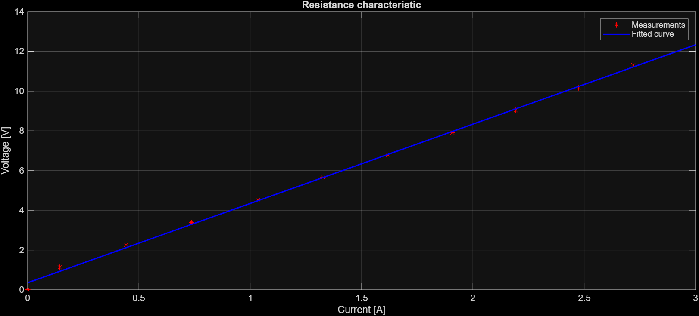
*Rys. 3. Charakterystyka rezystancji obwodu.*

**Uzyskana wartość rezystancji wynosi: $R = 3,9924$ [$\Omega$].**

### 2.3.2. Identyfikacja indukcyjności $L(x)$
Indukcyjność cewki zmienia się w zależności od położenia ferromagnetycznego rdzenia (kuli). Pomiary wykonano metodą impedancyjną dla dyskretnych punktów położenia kuli, a następnie dokonano aproksymacji funkcją wykładniczą sumy dwóch eksponent:

$$L(x) = a e^{bx} + c e^{dx}$$

Pochodna analityczna tej funkcji, niezbędna w równaniach stanu, wynosi:
$$\frac{\partial L(x)}{\partial x} = ab e^{bx} + cd e^{dx}$$

Dopasowanie parametrów przeprowadzono z wykorzystaniem algorytmu optymalizacji (funkcja fit w środowisku MATLAB), uzyskując współczynnik dopasowania na poziomie 95%.

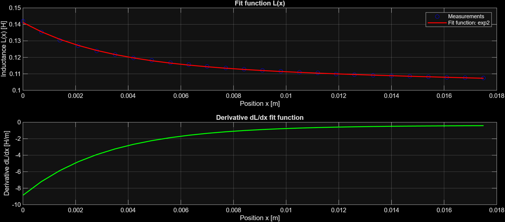
*Rys. 4. Wyznaczona charakterystyka $L(x)$ oraz jej pochodna.*

**Wyznaczone współczynniki:**

**$$a = 0,02711$$**
**$$b = -312$$**
**$$c = 0,114$$**
**$$d = -3,521$$**

## 2.4. Wyznaczenie punktu pracy

W celu zaprojektowania regulatora liniowego konieczne było wyznaczenie punktu pracy (punktu równowagi), wokół którego nastąpi linearyzacja. 

Dla stanu ustalonego pochodne zmiennych stanu muszą być równe zeru:
($\dot{x}=0, \dot{v}=0, \dot{i}=0$).

Po uwzględnieniu tych warunków w równach (2.8-2.10) prowadzi to do układu równań algebraicznych:

$$\begin{cases}
v_0 = 0 \\
\frac{1}{2m} \left. \frac{\partial L(x)}{\partial x} \right|_{x_0} i_0^2 + g = 0 \\
u_0 - R i_0 = 0
\end{cases}
\quad(2.11 - 2.13)$$

Na podstawie powyższych zależności wyznaczono funkcję, zestawiającą wymagane napięcie sterujące z zadanym położeniem kuli.

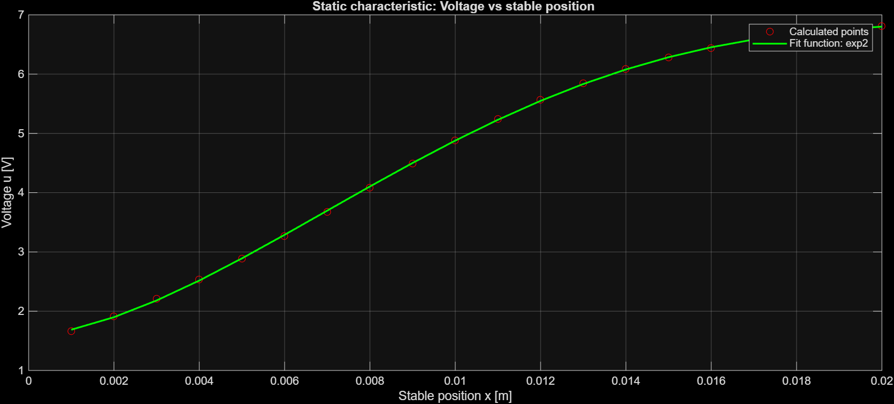
*Rys. 5. Zależność parametrów punktu pracy od położenia kuli.*

Do dalszej syntezy układu regulacji przyjęto następujący punkt pracy:

$$\begin{bmatrix}
x_0 \\
v_0 \\
i_0
\end{bmatrix}=
\begin{bmatrix}
0.01 [m] \\
0 [\frac{m}{s}] \\
1.2219 [A]
\end{bmatrix}$$

Odpowiadające napięcie sterujące: $u_0 = 4.8785$ [V].

## 2.5. Linearyzacja modelu 
Przeprowadzono linearyzację modelu wokół wyznaczonego punktu pracy.

Macierze Jacobiego układu wyznaczono według poniższych równań:

$$A = \left. \frac{\partial f}{\partial x_{stan}} \right|_{x_0, u_0}, \quad B = \left. \frac{\partial f}{\partial u} \right| _{x_0, u_0}$$

Obliczenia zrealizowano w środowisku MATLAB (Symbolic Math Toolbox), a następnie podstawiono wartości liczbowe parametrów. 

Otrzymano model w przestrzeni stanu postaci:

$$
\dot{\tilde{x}} = A \tilde{x} + B \tilde{u} 
$$
$$
\tilde{y} = C \tilde{x} + D \tilde{u}
$$

gdzie $\tilde{x}, \tilde{u}, \tilde{y}$ oznaczają odchyłki od punktu pracy:
$$\tilde{x} = x - x_0$$
$$\tilde{u} = u - u_0$$
$$\tilde{y} = y - y_0$$

Wynikowe macierze modelu:

$$
A = 10^3 \cdot
\begin{bmatrix}
0 & 0,001 & 0 \\
1,5178 & 0 & -0,016 \\
0 & 0,0084 & -0,0359 \\
\end{bmatrix}
$$

$$
B =
\begin{bmatrix}
0 \\
0 \\
8,9872
\end{bmatrix}
$$

$$
C =
\begin{bmatrix}
1 & 0 & 0
\end{bmatrix}
$$

$$
D =
\begin{bmatrix}
0
\end{bmatrix}
$$

## 2.6. Synteza regulatora LQR

Po wyznaczeniu modelu zlinearyzowanego przystąpiono do syntezy regulatora optymalnego LQR. 

Celem jest znalezienie sterowania minimalizującego wskaźnik jakości $J$:
$$J = \int_{0}^{\infty} \left( x(t)^T Q x(t) + u(t)^T R u(t) \right) dt$$

Gdzie macierze wag $Q$ i $R$ dobrano empirycznie, aby zapewnić jak najlepsze parametry regulajci. Ostatecznie przyjęto:

$$
Q =
\begin{bmatrix}
\frac{1}{1.2^2} & 0 & 0 \\
0 & \frac{1}{2^2} & 0 \\
0 & 0 & \frac{1}{2^2} \\
\end{bmatrix}
$$
$$
R = [\text{0.1}]
$$

Wzmocnienie $K$ wyznaczone z algebraicznego równania Riccatiego zapewnia stabilizację układu w punkcie pracy.

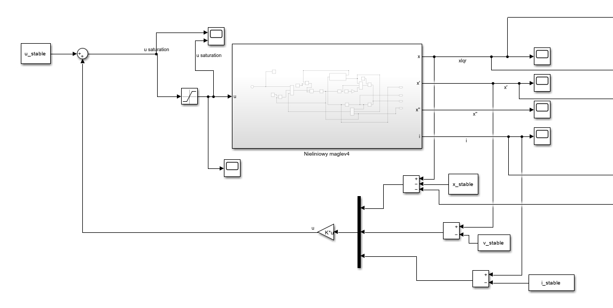
Rys. 6. Implementacja regulatora LQR w środowisku Simulink.

## 2.7. Synteza regulatora LQI

Ze względu na konieczność eliminacji uchybu ustalonego (powstającego m. in. na skutek nagrzewania się cewki i zmian rezystancji), rozszerzono strukturę sterowania o człon całkujący (LQI).

Wprowadzono dodatkową zmienną stanu:
$$
\dot{x}_ I = x_{zad} - x
$$

Dla tak rozszerzonego modelu wyznaczono wektor wzmocnień, obejmujący zarówno sprzężenie od zmiennych stanu obiektu, jak i od całki uchybu:

$$u(t) = -K x(t) - K_I \int (x_{zad} - x(t)) dt$$

Takie podejście zwiększa odporność układu na zakłócenia niskoczęstotliwościowe i błędy modelowania.

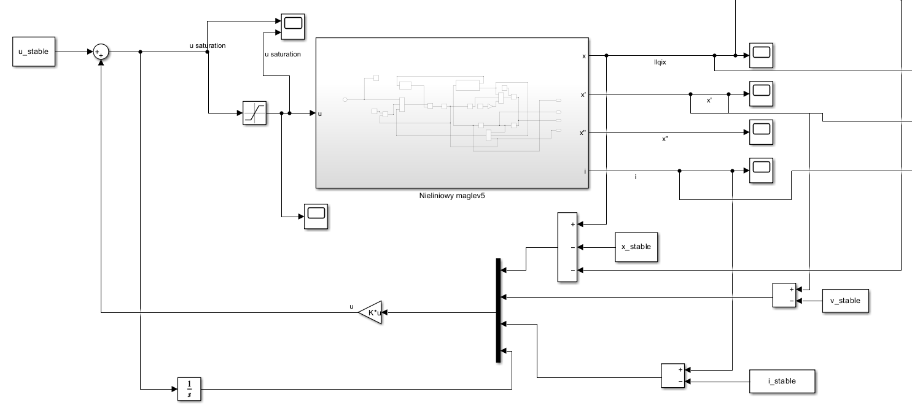
Rys. 7. Implementacja regulatora LQI w środowisku Simulink.

# 3. Wyniki i analiza porównawcza LQR/LQI

W tej części przedstawiono wyniki eksperymentów wykonanych na stanowisku lewitacji magnetycznej dla regulatorów **LQR** oraz **LQI**. Pomiary zostały zestawione parami dla identycznych scenariuszy wartości zadanej, co umożliwia bezpośrednie porównanie obu struktur regulacji.

Na obecnym etapie w sprawozdaniu uwzględniono wyniki **z obiektu rzeczywistego**. W dalszej kolejności zostaną dodane przebiegi **z symulacji** w tym samym układzie, aby możliwe było porównanie zgodności modelu z zachowaniem rzeczywistym.

---

## 3.1. Plan i opis pomiarów

Zestaw danych pomiarowych obejmował dziesięć eksperymentów. Pomiary zostały zestawione parami w celu bezpośredniego porównania regulatorów LQR i LQI przy tej samej wartości zadanej.

- Pomiary **1–2**: regulacja do stałego położenia **1 cm**.
- Pomiary **3–8**: śledzenie trajektorii sinusoidalnych z bazowym przesunięciem **1 cm** dla różnych amplitud i częstotliwości.
- Pomiary **9–10**: regulacja do stałego położenia **0.5 cm**.

Poniżej zestawienie serii pomiarowej:

| Pomiar | Regulator | x_zad [cm] | Sinus | A [mm] | f [Hz] |
|---|---|---|---|---|---|
| 1 | LQR | 1 | False |  |  |
| 2 | LQI | 1 | False |  |  |
| 3 | LQR | 1 | True | 2.00 | 0.3 |
| 4 | LQI | 1 | True | 2.00 | 0.3 |
| 5 | LQR | 1 | True | 4.00 | 0.3 |
| 6 | LQI | 1 | True | 4.00 | 0.3 |
| 7 | LQR | 1 | True | 2.00 | 1 |
| 8 | LQI | 1 | True | 2.00 | 1 |
| 9 | LQR | 0.5 | False |  |  |
| 10 | LQI | 0.5 | False |  |  |

---

## 3.2. Zbiór wyników i sposób porównania

Do oceny jakości regulacji wykorzystano przebiegi położenia kulki oraz sygnału sterującego zarejestrowane podczas eksperymentów. Wyniki uporządkowano w pary pomiarów, tak aby dla każdego scenariusza porównać odpowiedzi uzyskane przez LQR oraz LQI.

Dla ilościowej oceny działania regulatorów przyjęto:
- błąd średniokwadratowy (RMS) względem wartości zadanej,
- maksymalny błąd bezwzględny,
- w przypadku wartości zadanej stałej — orientacyjny uchyb w końcowej fazie odpowiedzi.

---

## 3.3. Tabela wskaźników jakości – obiekt rzeczywisty

| Scenariusz | IAE LQR $[\text{mm} \cdot \text{s}]$ | ISE LQR $[\text{mm}^2 \cdot \text{s}]$ | IAE LQI $[\text{mm} \cdot \text{s}]$ | ISE LQI $[\text{mm}^2 \cdot \text{s}]$ |
| :--- | :--- | :--- | :--- | :--- |
| $\text{x}=1.0 \text{ cm}$ | $0.02352432277171594$ | $7.24643814471274\text{e}-05$ | $0.02352432277171594$ | $7.24643814471274\text{e}-05$ |
| $\text{x}=0.5 \text{ cm}$ | $0.037963010341092374$ | $0.0001710210286853249594$ | $0.0166434604709695$ | $0.000113771417487475$ |

## 3.4. Analiza jakościowa

Na podstawie wstępnej analizy przebiegów rzeczywistych można oczekiwać, że regulator **LQI** będzie wykazywał przewagę nad **LQR** przede wszystkim w zadaniach regulacji do stałej wartości zadanej, gdzie człon całkujący powinien prowadzić do redukcji uchybu ustalonego.

W scenariuszach śledzenia wymuszeń sinusoidalnych różnice między regulatorami mogą ujawniać się w:
- wartości błędu RMS,
- zdolności do odtwarzania amplitudy zadanej trajektorii,
- ewentualnym przesunięciu fazowym odpowiedzi,
- poziomie i dynamice sygnału sterującego.

Po dodaniu wyników symulacyjnych możliwa będzie ocena, na ile rozbieżności wynikają z niedokładności modelu, a na ile z ograniczeń sprzętowych stanowiska oraz nieliniowości obiektu poza wąskim otoczeniem punktu pracy.

---

## 3.5. Wyniki szczegółowe dla scenariuszy

Dla każdego scenariusza przewidziano miejsce na dwa zestawy wykresów:
1) **obiekt rzeczywisty**,  
2) **symulacja**.

### 3.5.1. Scenariusz 1: stabilizacja do 1 cm (LQR vs LQI)

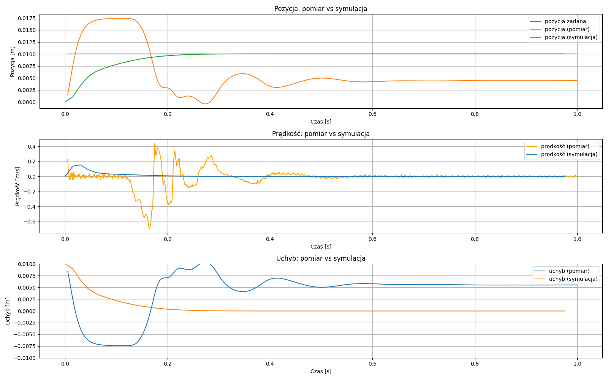
Rys. 8. Wykres stablizacji na 1 cm LQR.

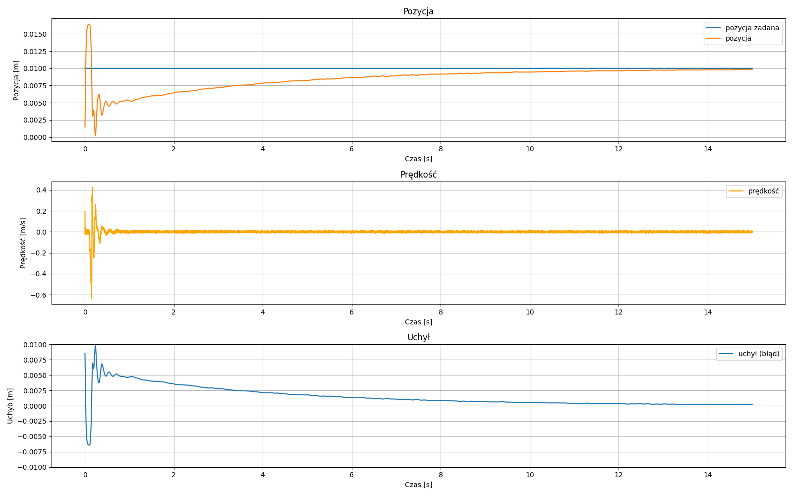
Rys. 9. Wykres stablizacji na 1 cm LQI.

### 3.5.2. Scenariusz 2: 1 cm + sin, A = 2 mm, f = 0.3 Hz

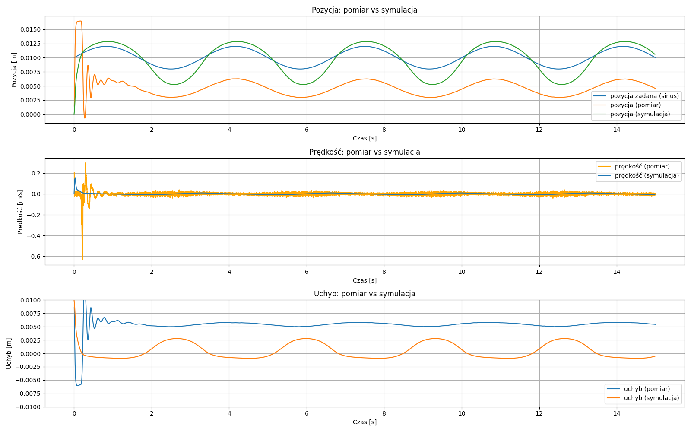
Rys. 10. Wykres podążania za sinusoidą A=2 mm i f=0.3 Hz LQR.

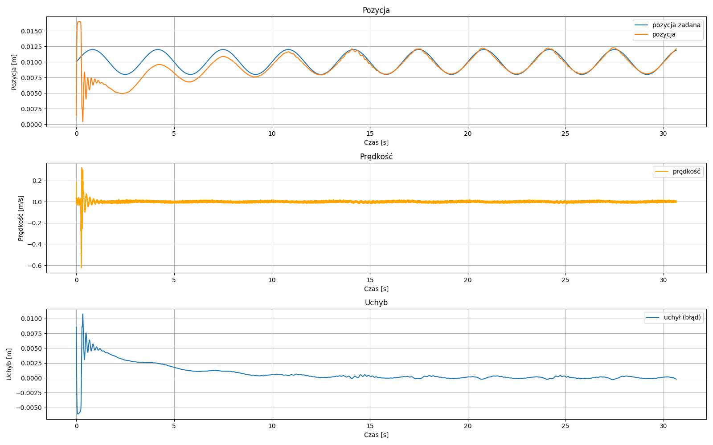
Rys. 11. Wykres podążania za sinusoidą A=2 mm i f=0.3 Hz LQI.

### 3.5.3. Scenariusz 3: 1 cm + sin, A = 4 mm, f = 0.3 Hz

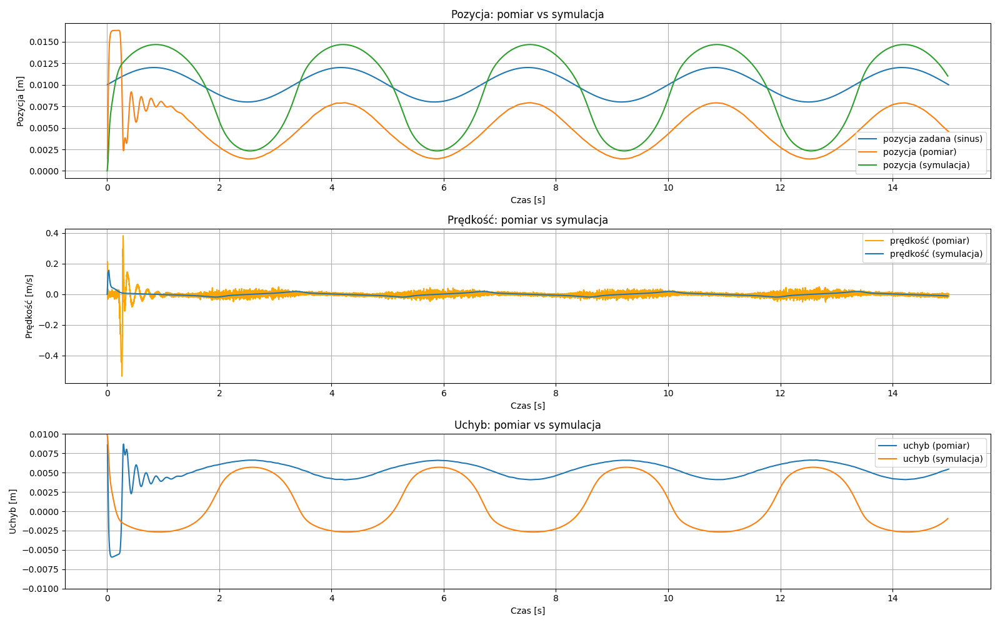
Rys. 12. Wykres podążania za sinusoidą A=4 mm i f=0.3 Hz LQR.

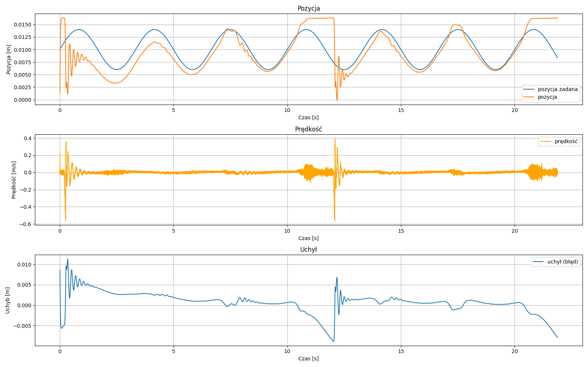
Rys. 13. Wykres podążania za sinusoidą A=4 mm i f=0.3 Hz LQI.

### 3.5.4. Scenariusz 4: 1 cm + sin, A = 2 mm, f = 1 Hz

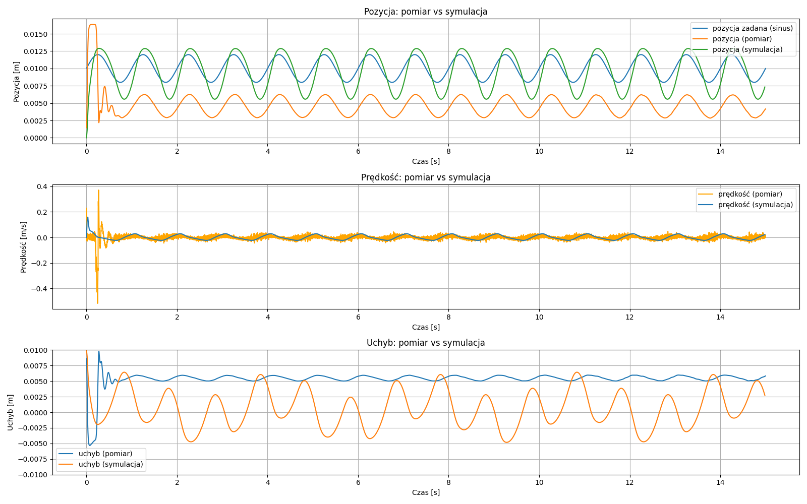
Rys. 14. Wykres podążania za sinusoidą A=2 mm i f=1 Hz LQR.

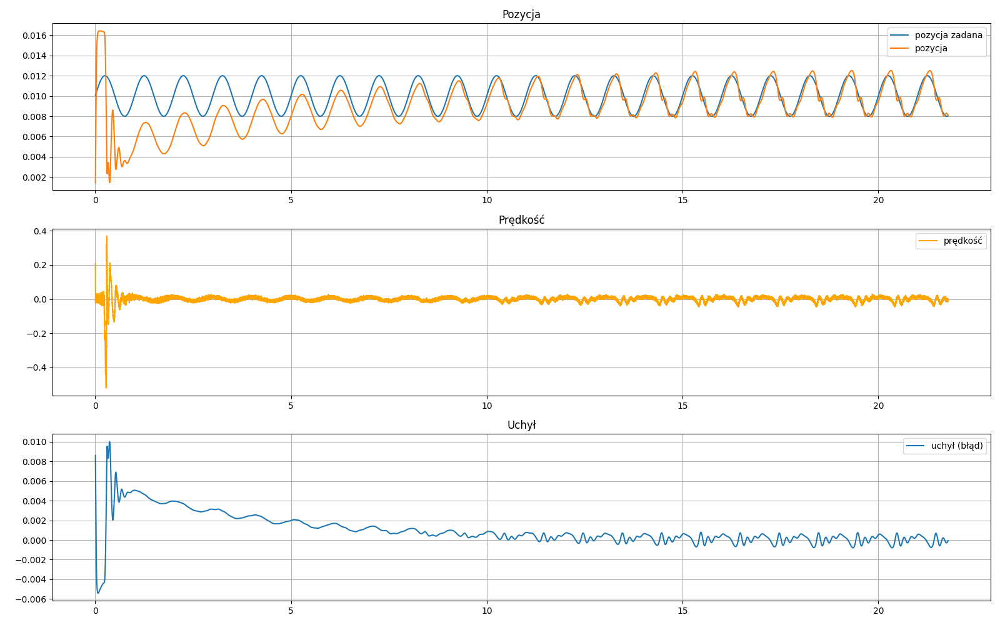
Rys. 15. Wykres podążania za sinusoidą A=2 mm i f=1 Hz LQI.

### 3.5.5. Scenariusz 5: stabilizacja do 0.5 cm (LQR vs LQI)

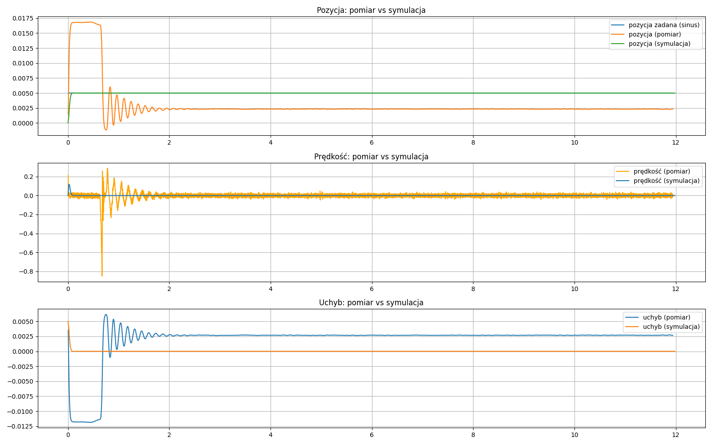
Rys. 16. Wykres stablizacji na 0.5 cm LQR.

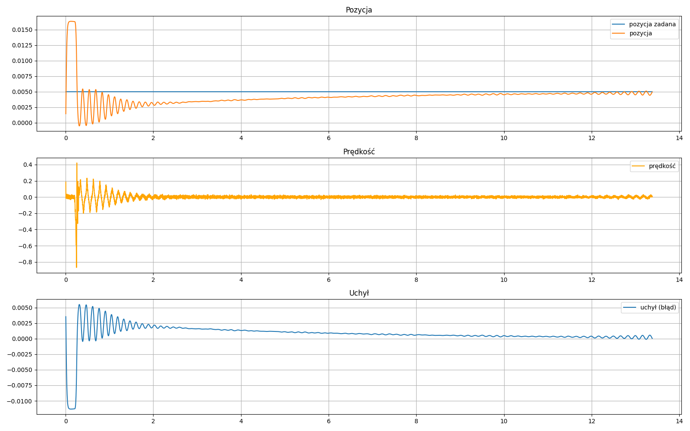
Rys. 17. Wykres stablizacji na 0.5 cm LQI.

---

# 4. Wskaźniki jakości

W celu ilościowego porównania regulatorów obliczono błąd położenia względem wartości zadanej. Dla każdego scenariusza wyznaczono:
- **RMS błędu**,
- **maksymalny błąd bezwzględny**.

W scenariuszach ze stałą wartością zadaną dodatkowo oszacowano **średni uchyb ustalony** jako średnią z końcowych 10% próbek.

| Scenariusz | RMS LQR [mm] | RMS LQI [mm] | Max |e| LQR [mm] | Max |e| LQI [mm] | e_ss LQR [mm] | e_ss LQI [mm] |
|---|---:|---:|---:|---:|---:|---:|
| x=1.0 cm | 5.60 | 1.64 | 10.40 | 10.00 | -5.64 | -0.03 |
| x=1 cm + sin, A=2 mm, f=0.3 Hz | 5.51 | 1.68 | 11.67 | 10.76 |  |  |
| x=1 cm + sin, A=4 mm, f=0.3 Hz | 5.52 | 2.70 | 10.00 | 11.31 |  |  |
| x=1 cm + sin, A=2 mm, f=1.0 Hz | 5.51 | 2.00 | 10.00 | 10.01 |  |  |
| x=0.5 cm | 3.79 | 2.03 | 11.86 | 11.33 | -2.69 | -0.32 |

---

# 5. Wnioski końcowe

Na podstawie przeprowadzonych pomiarów można zauważyć, że regulator **LQI** w większości badanych scenariuszy zapewniał mniejszy błąd RMS położenia w porównaniu do **LQR**. W szczególności w zadaniach regulacji do stałej wartości zadanej obserwowano istotną redukcję uchybu ustalonego, co jest zgodne z oczekiwaniami wynikającymi z obecności członu całkującego.

W scenariuszach śledzenia sygnałów sinusoidalnych LQI również wykazywał lepsze dopasowanie średniokwadratowe, jednak pełna ocena działania regulatorów powinna uwzględniać poziom i dynamikę sygnału sterującego oraz ograniczenia sprzętowe aktuatora.

Identyfikacja **L(x)** dostarczyła spójnego opisu zależności indukcyjności od położenia i stanowi ważny element przygotowania modelu obiektu. W przyszłości warto rozważyć rozszerzenie procedury identyfikacji o uwzględnienie niepewności pomiaru oraz porównanie z alternatywnymi metodami aproksymacji.

Filtrowanie sygnałów pochodzących z czujników jest bardzo ważna w układach sterowania, ponieważ pozwala na eliminację szumu, który w innym przypadku byłby błędnie interpretowany przez regulator jako gwałtowne zmiany stanu. Szumy te prowadzą do generowania niestabilnych sygnałów sterujących i wywołuje niepożądane oscylacje w systemie fizycznym. Zastosowanie odpowiednich filtrów sprawia, że sygnał staje się stabilny, skutecznie eliminując te oscylacje i zapewniając płynną pracę.

---

